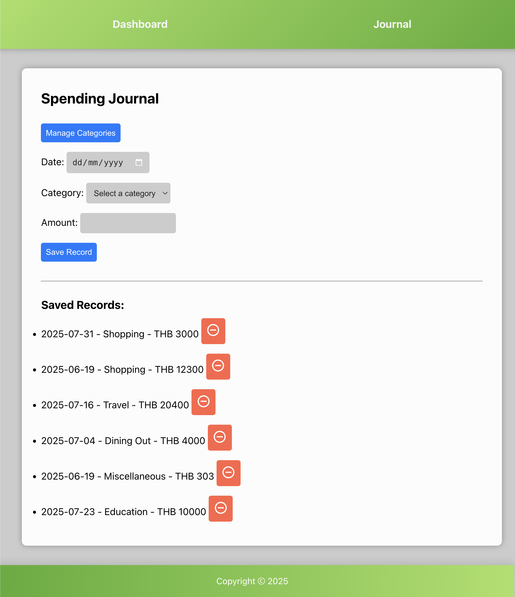
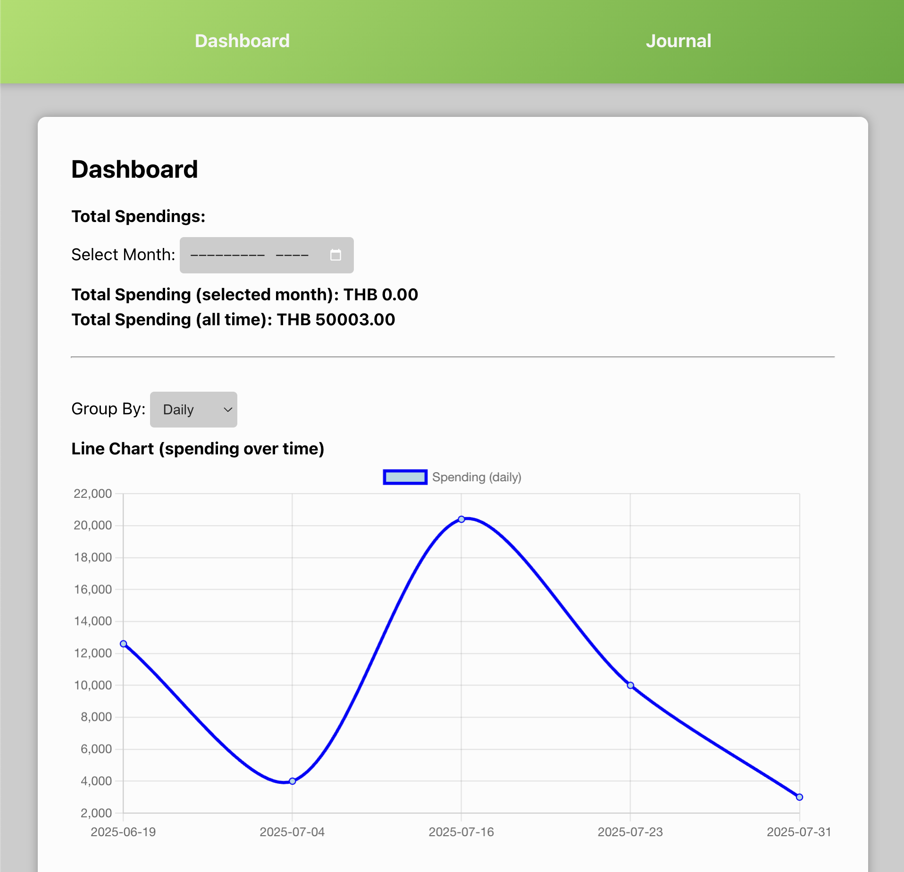
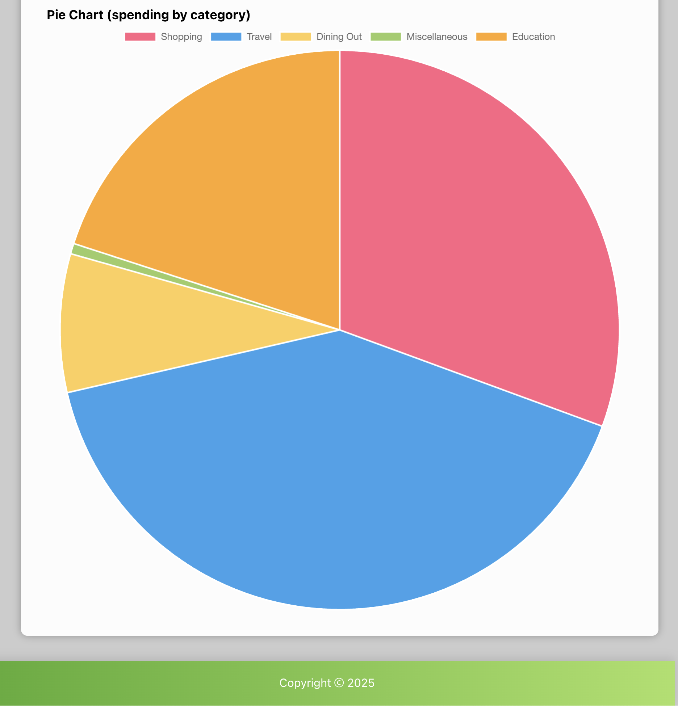

# 💸 Spending Tracker App

A simple and beginner-friendly React.js web application to track daily, weekly, and monthly spending. Built with `react-use`, `chart.js`, and `localStorage`. No backend. Fully client-side.

## 📸 Screenshots

### Journal Page

### Dashboard Page

---

## 🔗 Live Demo

🌐 GitHub Pages: [Click to View Live App](https://pmnoia.github.io/spending-tracker/)

---

## 🧠 Features

- 🧾 **Journal Page** to log spending by category and date
- 📊 **Dashboard Page** with:
  - Total spending (all-time and monthly)
  - Filter by daily / weekly / monthly
  - Line and Pie Charts (using Chart.js)
- ➕ Add custom spending categories
- 💾 Persistent data with Local Storage
- 🖼️ Responsive, clean UI with green gradient theme

---
